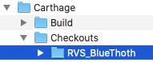
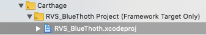
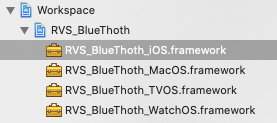
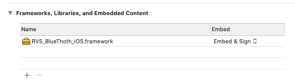
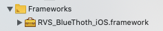

RVS_BlueThoth
=

This is a Bluetooth SDK for "Central" (Client) Core Bluetooth (BLE) implementation.

It abstracts some of the more "tedious" aspects of using Core Bluetooth; allowing the app to easily implement a Bluetooth Client functionality.

[This is the GitHub repo for this project.](https://github.com/RiftValleySoftware/RVS_BlueThoth) It is 100% open-source, MIT-licensed code.

INSTALLATION
=
COCOAPODS
-
Once the project is ready for its debutante ball, I'll set up a podspec.
We're not there, yet.

We will not have a podfile in the RVS_BlueThoth project, as we want to simplify the dependency chain (See note, below).

CARTHAGE
-
In your [Cartfile](https://github.com/Carthage/Carthage/blob/master/Documentation/Artifacts.md#cartfile), simply add the following line:

    github "https://github.com/RiftValleySoftware/RVS_BlueThoth"
    
Then, once that's done, use [Terminal](https://support.apple.com/guide/terminal/welcome/mac) to [`cd`](https://www.freebsd.org/cgi/man.cgi?query=cd) to the directory that you want to use to receive the project, and run the following command:

    carthage update
    
This will create a directory called "`Carthage`", which will contain the library in a subdirectory, called "`Checkouts`," inside of which, you will find another subdirectory called "`RVS_BlueThoth`."

_Fig. 1: The BlueThoth Directory in the Carthage Directory_

**IMPORTANT NOTE**

Because of the complexity of code-signing, and also in order to improve the robustness of the project (by making it simple to use dependencies), I don't have Carhage build the framework.

Instead, you should import the "`RVS_BlueThoth.xcodeproj`" project file into your project or workspace, and declare the appropriate frameworkto be an embedded framework (there are framework targets for all 4 major Apple operating system targets). Your project will make it a dependency.

_Fig. 2: Including the BlueThoth Project File Into Your Own Project_

_Fig. 3: Selecting the Target Framework_

_Fig. 4: The Target Framework As An Embedded Framework_

_Fig. 5: The Framework Will Now Appear in the Project Navigator Frameworks Group_

In order to use the framework, you will now need to include it:

    import RVS_BlueThoth_iOS
    
***NOTE:** The iOS version is shown in all the above examples. The same workflow applies across all platforms.*

**IMPORTANT NOTE**

Even though there is a [Cartfile](https://github.com/Carthage/Carthage/blob/master/Documentation/Artifacts.md#cartfile) in the RVS_BlueThoth directory, and it includes its own Carthage dependencies, we have checked the "`Carthage`" directory into the repo, as we want it to be available for other dependency management systems.

SIMPLE GIT SUBMODULE
-
You can also simply clone [the project]((https://github.com/RiftValleySoftware/RVS_BlueThoth)) as [a Git submodule](https://git-scm.com/book/en/v2/Git-Tools-Submodules) into your own project, and follow the same workflow as the Carthage installation to add the framework to your project.